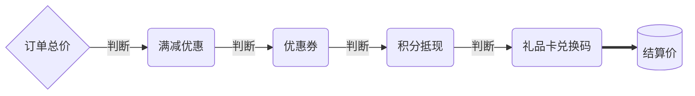

import Img from '@site/src/components/images';

点击**营销**->**满减优惠**，开启后点击**增加优惠项**，填入满足条件金额及优惠金额，至多设置五级优惠，其中每下一级优惠满足条件金额必须大于上一级，如图所示

:::tip
**满减优惠**为全局设置，无论是普通订单或拼团等其他营销活动订单总价计算结算价时均优先判断是否有满减优惠逻辑并计算，所以在设置**满减优惠**后请结合成本和提成等适当确定商品价格

:::
