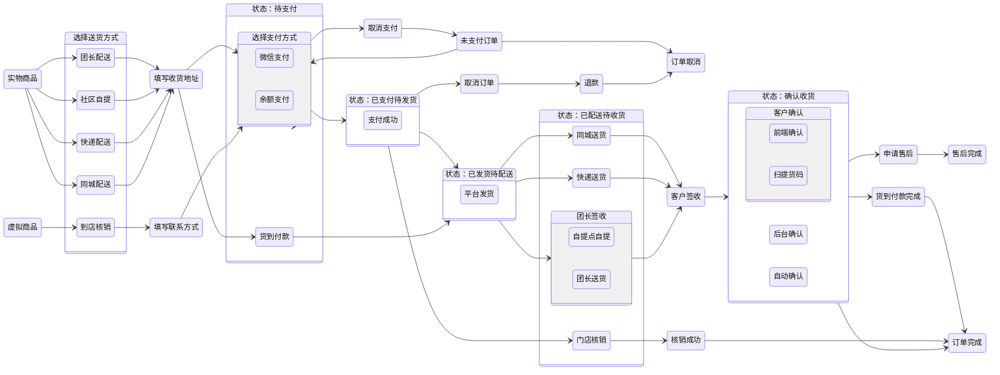

import Img from '@site/src/components/images';

```mermaid
stateDiagram
    direction LR
    实物商品-->快递配送 
    实物商品-->社区自提
    实物商品-->团长配送
    实物商品-->同城配送
    虚拟商品-->到店核销
    state 选择送货方式 {
        direction LR
        团长配送 社区自提 快递配送 同城配送 到店核销
    }
    团长配送-->填写收货地址
    社区自提-->填写收货地址
    快递配送-->填写收货地址
    同城配送-->填写收货地址
    填写收货地址-->选择支付方式
    填写收货地址-->货到付款
    state 状态：待支付 {
        state 选择支付方式 {
            direction LR
            微信支付 余额支付
        }
        direction LR
        货到付款
    }
    到店核销-->填写联系方式
    选择支付方式-->取消支付
    取消支付-->未支付订单
    未支付订单-->选择支付方式
    未支付订单-->订单取消
    填写联系方式-->选择支付方式
    状态：待支付-->选择支付方式
    状态：已支付待发货-->取消订单
    取消订单-->退款
    退款-->订单取消
    状态：已支付待发货-->门店核销
    状态：已支付待发货-->状态：已发货待配送
    state 状态：已发货待配送 {
        direction LR
        平台发货
    }
    状态：已发货待配送-->同城送货
    状态：已发货待配送-->快递送货
    状态：已发货待配送-->团长签收
    state 状态：已支付待发货 {
        direction LR
        支付成功
    }
    选择支付方式-->状态：已支付待发货
    
    state 状态：已配送待收货 {
    state 团长签收 {
        direction LR
        自提点自提 团长送货
    }
        direction LR
        门店核销 快递送货 同城送货
    }
    同城送货-->客户签收
    快递送货-->客户签收
    团长签收-->客户签收
    客户签收-->状态：确认收货
    state 状态：确认收货 {
        direction LR
            state 客户确认 {
                direction LR
                前端确认 扫提货码 
            }
        后台确认
        自动确认 
    }
    门店核销-->核销成功
    货到付款-->状态：已发货待配送
    状态：确认收货-->申请售后
    状态：确认收货-->货到付款完成
    申请售后-->售后完成
    货到付款完成-->订单完成
    状态：确认收货-->订单完成
    核销成功-->订单完成
```
