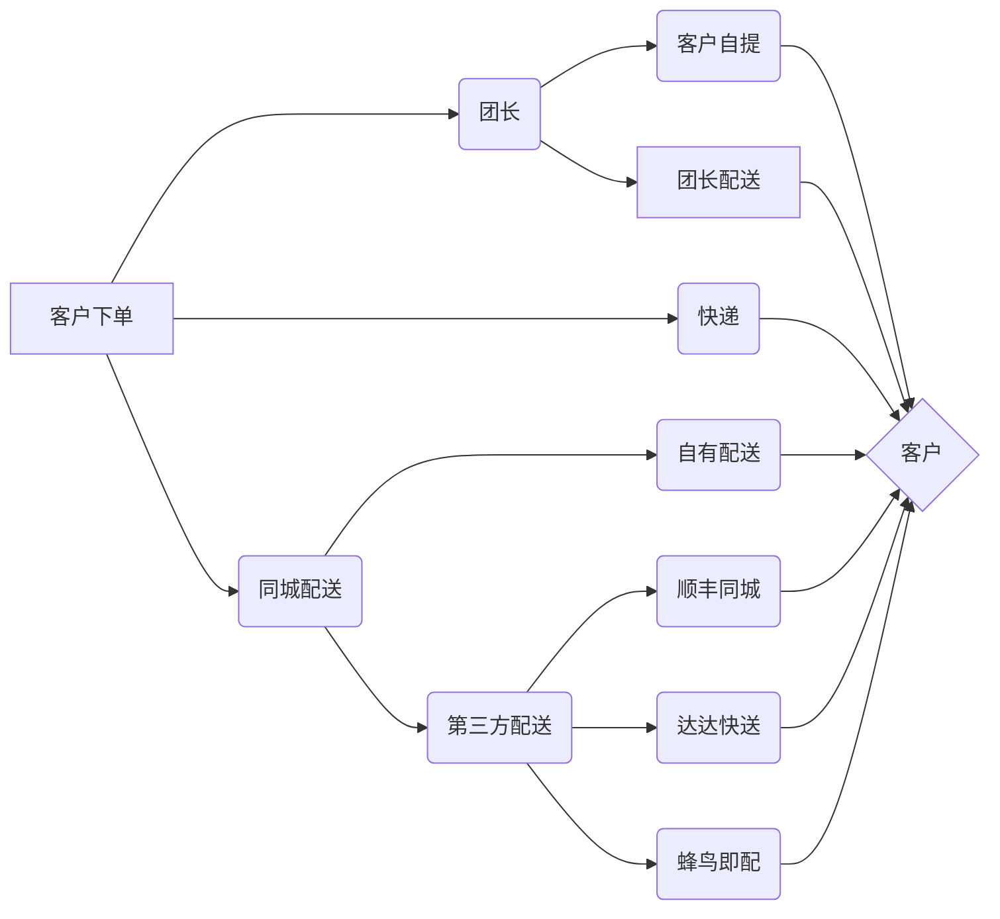

import Img from '@site/src/components/images';

:::tip
本章介绍商品成功下单后（不含到店核销商品）同城近距离的配送和远程快递物流设置，在正式运营之前应与[**订单设置**](/operate/goods.md)同时完善
:::

除了到店核销商品之外，其他商品均须配送或物流，本系统有三种传统配送方式：**团长配送**、**客户自提**、**快递**。除快递以外，团长配送和客户自提均需平台发货至团长，再根据设置的商品属性选择自提或团长配送，如果需要平台直接配送或第三方配送（顺丰、达达、蜂鸟），则需要选择开启**同城配送**

## 传统配送方式设置
点击**设置**->**物流设置**->**配送方式设置**，自定义选择开启订单提交页面配送方式：**团长配送**、**社区自提**和**快递**，亦可编辑自定义名称及配送费

开启后小程序端订单提交页中相对应显示配送方式，后台可拖动标题可操作小程序端配送方式排序

:::tip
上图订单提交页中还有**同城配送**和**到店核销**，其中开启**到店核销**请参阅**门店**中的[**到店核销**](/operate/goods.md)，**同城配送**请参阅下一节内容
:::

## 同城配送

### 同城配送设置
除了传统配送方式，某些经营场景还需要平台直接配送（自有配送）或第三方专业配送（顺丰、达达、蜂鸟），这时我们需要先设置**同城配送**，点击**设置**->**物流设置**->**同城配送设置**

开启同城配送的前提是需要系统设置Redis，详细设置请参阅[**Redis**](/operate/goods.md)
开启后请按照需求设置出单时长、配送时长、包装自定义名称、服务距离、配送费、确认送达距离、抢单距离、店铺详细信息和营业时间段等，设置完毕后点击**提交**

:::info 关键设置
- **配送员抢单距离**: 设置配送员距离店铺多少米内可以进行抢单处理
- **确认送达距离**: 设置配送员距离用户指定的收货地点多少米内才可以点击“确认送达”，确保配送员百分百将商品配送到指定地点
- **配送员抢单距离**: 设置配送员距离店铺多少米内可以进行抢单处理，可有效控制配送员随意接单造成商品配送不及时
:::

### 同城配送商品
开启同城配送后添加/编辑商品时，则该选项卡将显示，勾选后小程序端订单提交页该商品将显示**同城配送**标签，

:::tip
上图订单提交页中还有**同城配送**和**到店核销**，其中开启**到店核销**请参阅**门店**中的[**到店核销**](/operate/goods.md)，**同城配送**请参阅下一节内容
:::

## 自有配送
如果平台经营场景为自有配送员直接送货上门，请在后台**订单**中的**自有配送**设置自有配送员及其配送佣金

### 自有配送员
点击**订单**->**配送员管理**->**添加配送员**

输入**配送员姓名、电话、常驻地址**，选择**关联客户**和**状态**后**提交**

配送员添加成功后该配送员登录的小程序端个人中心会显示**配送员中心**，**配送记录**可在列表中点击查询

### 配送员佣金
点击**订单**->**配送设置**，可统一设置配送佣金模式，按经营场景选择并填入

### 佣金提现及设置
与团长提成类似，点击**订单**->**配送佣金提现设置**，设置**最小提现金额**、**提现手续费**、**提现方式**和**提现说明**

**当配送员佣金大于设置的**最小提现金额**时，配送员可在小程序端**个人中心**->**配送员中心**->**我的**申请提现

申请后后台可显示在**配送佣金列表**，可单独或批量审核操作

### 配送员通知
- **~~公众号模板通知~~**: 配送员关注同主体公众号后，点击**设置**->**模板消息**，设置**同城配送配送员接单通知**，在有同城配送订单的时候，公众号会以消息方式通知配送员进行接单（该功能因模板消息即将废弃而停止使用）
  

- **小程序端语音通知**: 配送员在小程序端**个人中心**->**配送员中心**->**我的**，开启**小程序语音来单通知**后，在有同城配送订单的时候，会语音通知配送员接单
  

## 第三方配送
本系统目前接入了三种第三方平台配送：顺丰、达达、蜂鸟，需要第三方平台配送请根据所在城市支持度和口碑等酌情选择订立合同并按以下流程设置

### 达达快送
点击**设置**->**物流设置**->**平台配送（达达）**，开启**达达快送**

点击上图**达达开放平台**，跳转至其平台官网，选择**商家入驻**，按流程注册后获取**商户编号**、**门店编号**、**APPKey**和**APPSecret**后填入后台**设置**->**物流设置**->**平台配送（达达）**中后**提交**

复制**达达消息URL地址**粘贴至**达达后台管理中心**->**账号中心**->**属性设置**->**消息URL地址**处

### 顺丰同城
点击**设置**->**物流设置**->**平台配送（顺丰）**，开启**顺丰同城**

点击上图**顺丰同城开放平台**，跳转至其平台官网，点击**注册**，注册成功后按流程获取**开发者ID(dev_id)**、**密钥(dev_key)**和**顺丰店铺ID**后填入后台**设置**->**物流设置**->**平台配送（顺丰）**中后**提交**

复制**顺丰同城回调URL**粘贴至**顺丰同城开放平台**->**开发者中心**->**开发者信息**->**回调URL**处

### 蜂鸟即配
点击**设置**->**物流设置**->**平台配送（蜂鸟）**，开启**蜂鸟即配对接**

点击上图**蜂鸟即配开放平台**，跳转至其平台官网，点击**我要入驻**，选择商家**点击入驻**，注册成功后按流程获取**商户APPID**、**商户SecretKey**、**门店编号**、**门店名称**、**取货点联系方式**，其中**取货点经度**、**取货点纬度**和**取货点地址**应于后台**设置**->**同城配送设置**中的店铺地址和经纬度一致，获取后后填入后台**设置**->**物流设置**->**平台配送（蜂鸟）**中，**取货点地图选择**推荐选择**高德地图**，完成后点击**提交**

### 订单推送
如果选择了第三方配送，以上第三方配送设置完成后应开启**订单推送**使订单信息自动推送到第三方配送平台，点击**设置**->**物流设置**->**订单推送设置**，开启并选择相应第三方配送后提交

## 快递设置
如果平台某些商品的发货渠道是快递物流，应参阅本章**传统配送方式设置**开启**快递**，对应的商品应选择下一节中设置的运费模板，详情请参阅[**商品**](/operate/goods.md)

:::tip
如果新增/编辑商品时开启了**网商模式**（仅快递），用户下单时除了快递以外其他配送方式将不可用，详情请参阅[**商品**](/operate/goods.md)，如果需要仅快递商品独立于其他商品成为一个前端页面模块，请参阅[**网商**](/operate/goods.md)
:::

### 运费模板
在新增/编辑商品时，需要快递的商品运费选择时可直接输入**统一邮费**或选择**运费模板**，所以添加商品之前建议设置好运费模板，点击**设置**->**物流设置**->**运费模板**->**添加运费模板**

自定义**输入运费模板名称**和**排序**，按经营需求选择**按重量计费**或**按件计费**，下方输入**全局规则**，则全国范围内所有地区统一按此规则进行运费计算

如果物流至不同区域运费不尽一致，请点击**新增独立规则物流区域**，勾选需要编辑的省/自治区/直辖市，也可于鼠标悬停下方独立勾选该省/自治区/直辖市的下级行政区域，输入上方规则（首费、续费等）后点击**确定**

重复以上步骤，点击**新增独立规则物流区域**，继续勾选未勾选的区域并输入独立规则，如下图如要修改某些区域的规则，请点击该条目右上方**删除条目**后重新添加，直至设置完成后点击**提交**

:::danger 重要提示
**独立规则**设置后上方**全局规则**将失效，**独立规则**建议应设置涵盖全国各个区域，如有未设置的区域，客户选择使用此条运费模板的商品将无法下单收货地址为未配置独立规则的区域，设置过的区域勾选框为灰色，将无法再次勾选，未设置的区域为高亮色，可轻易区分并选择

:::

:::tip
在新增/编辑商品时，如果选择**统一邮费**将无视客户距离及下单数量/重量统一邮费，适用于羽量级别的商品，推荐选择更加灵活的**运费模板**，根据重量/件数来计算运费，当物品不足首重/首件时，按照首重/首件费用计算，超过部分按照续重/续件数和续重/续件数费用乘积来计算
:::

### 快递管理
本系统已录入当前全球所有主要物流快递公司及其简码，可于**设置**->**物流设置**->**快递管理**中查看，如非必要请勿删除，如有本地物流信息需要添加，请点击右上方**添加快递信息**进行操作

:::tip
快递公司请自行选择并订立合同，无需在后台设置
:::

### 电子面单（快递鸟）
本系统接入了通用电子面单平台快递鸟，可方便平台查看多个签约快递的发货信息和管理电子面单，也可方便客户通过平台和快递鸟小程序查看物流信息
点击**设置**->**电子面单**->**物流接口设置**，点击**快递鸟接口申请**

通过手机号注册并完善公司信息后获得**用户ID**和**API key**填入上图后提交

点击**设置**->**电子面单**->**电子面单列表**->**添加快递**

填入签约的快递公司信息，具体详情请咨询快递鸟官方

:::tip
该平台需要预付费，请酌情选择，**免费模式**仅支持查询申通、中通、圆通物流轨迹
:::

